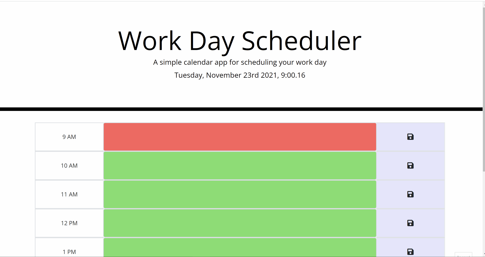

# Work-Day-Scheduler
A simple calendar app for scheduling your work day

## Mission

My mission on this assignment was to create a simple calendar application that allows a user to save events for each hour of the day by modifying the starter code given. This app will run in the browser and feature dynamically updated HTML and CSS powered by jQuery

## Utlized Support
* HTML
* CSS
* JavaScript
* jQuery
* Bootstrap
* Google Fonts
* Moment.js

## Process

As always, taking the lead of my instuctor, TA and tutor, I start with the flow of my code and how it would be most effective. The moment.js was utlized for the live date and time to be displayed in the header. 

Then I flowed to the time blocks, handle and just kept linking them together for a functioning day planner.

There was a lot of back and forth yet I mistakenly didn't check as often as I should have to see if the webpage was still functioning as it was before. At one point, I realized that the live date and time funtion didn't appear anymore.

I learned to focus on a certain part of code, but not get complete tunnel vision to where I neglect checking the rest. So then, with the support that I always have, I was guided with the order of my Javascript and how the page will run in the order of how it is structured. 

So after fixing bug after bug, I finally have a functioning day planner!

 

## Finished!

As always, I give complete credit to my instructor, TA and tutor and their never-ending patience and willingness to go over the same things with me over and over again. Although, I swear- I'm not getting a big head, but I found this assignment to be more doable and more easily understood from the get-go. I don't know if it's because I just finished up the previous beast of an assingment, but I found more joy in this assingment than any other thus far. I think I am in love with Bootstrap, jQuery, and especially, starter code.

## Have a Look See

## [See It For Yourself Here](https://jlee3883.github.io/Work-Day-Scheduler/) ❤️️
